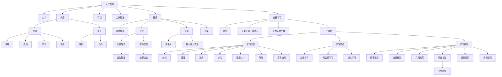

```mermaid
graph TD
A[人工智能] --> B[定义]
A --> C[内涵]
A --> D[特点]
A --> E[主体算法]
C --> F[思维]
C --> G[交互]
F --> H[求解]
F --> I[规划]
F --> J[学习]
F --> K[推理]
G --> L[感知]
G --> M[动作]
A --> N[搜索]
N --> O[经典搜索]
N --> P[优化]
N --> Q[博弈]
N --> R[约束]
P --> S[元启发式]
P --> T[群体智能]
S --> U[遗传算法]
T --> V[蚁群优化]
Q --> W[决策树]
Q --> X[最小最大算法]
A --> Y[机器学习]
Y --> Z[定义]
Y --> AA[可能近似正确学习]
Y --> AB[没有免费午餐]
Y --> AC[三个视角]
AC --> AD[学习任务]
AC --> AE[学习范式]
AC --> AF[学习框架]
AD --> AG[分类]
AD --> AH[回归]
AD --> AI[聚类]
AD --> AJ[排名]
AD --> AK[密度估计]
AD --> AL[降维]
AD --> AM[序贯决策]
AE --> AN[监督学习]
AE --> AO[无监督学习]
AE --> AP[强化学习]
AF --> AQ[概率框架]
AF --> AR[统计框架]
AF --> AS[几何框架]
AF --> AT[联结框架]
AF --> AU[逻辑框架]
AF --> AV[决策框架]
AT --> AW[神经网络]

```